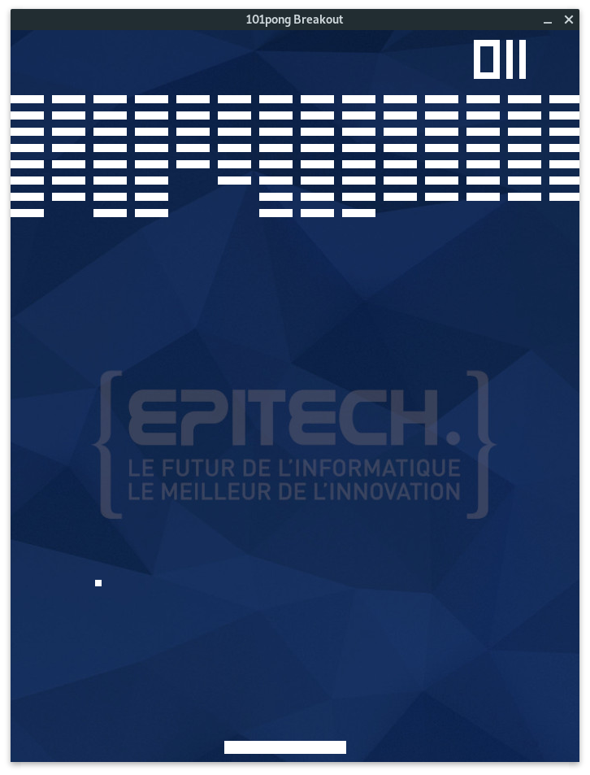

# 101pong_2019
Mathematics : Vector computations. And Breakout game (bonus).

Note: The pong game is in the bonus directory.

# How to launch
```bash
$> cd 101pong_2019/bonus
$> make
$> ./101pong_breakout

```
# Game preview

